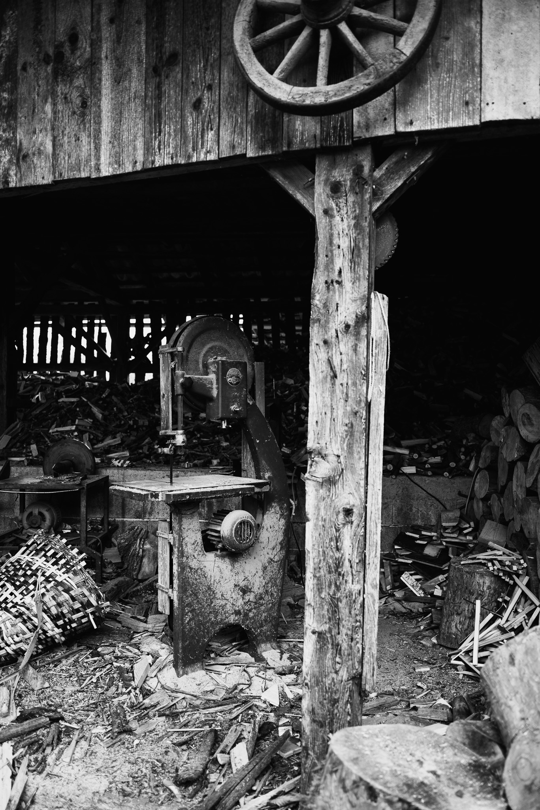
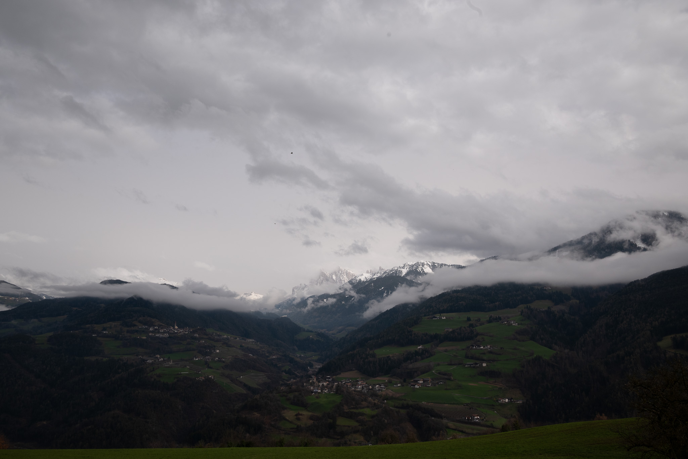

+++
title = "Welcome to Alto Adige"
date = 2024-03-31
series = ["Alto Adige"]
series_order = 1

+++

As an amateur photographer and passionate hiker, there's nothing quite like the thrill of exploring different landscapes with camera in hand. Having visited Alto Adige and South Tyrol multiple times, each visit feels like coming home to a place of unparalleled beauty and serenity. This time, I had the added joy of spending time with friends who call this breathtaking region their home.

Since it's still early spring and Easter is especially early this year, it's no surprise that there's still a lot of snow at higher altitudes. Sadly, this means I'm unable to embark on some of the famous hikes like the iconic Tre Cime di Lavaredo loop. However, every setback presents an opportunity for exploration in a different light. So, rather than being deterred by the snow-covered trails, I embraced the chance to discover lesser-known gems and experience familiar places in a new season.

### Säben Monachstry via Keschtn trail

During this visit, I had the opportunity to embark on a hike to Säben Monastery, perched atop a rocky outcrop overlooking the picturesque Eisack Valley. The monastery, with its rich history and stunning views, provided yet another memorable experience and a chance to capture the spiritual essence of this sacred place through my lens.



I started at the small chapel in Feldturns. Of course it was raining a lot early in the morning so i took an umbruelle in one hand and my camera in the other. Making my way through the Village and the Vineyards Southwards on the Keschtn Trail. The trail flows along the mountainside until you reach the 'Moar zur Viersch'. This farm and Inn is of significant historical meaning because it was build in the 9th century. During the summer months the inn is open but sadly was closed when i went by. After that the trails goes downhill through Orcards. On the way you can glimpse the Monachstry on its Rocky peak. After having a nice glass of wine and a 'Birmehl' i walked the last few meters up to the monachstry. Upon arival the Sky cleared somewhat so that i did not need my umburella anymore. I visited the Chapel and took a view pictures.
On my way back the sky had cleared enough to even take a photo of the Gruppo delle Odle.
i finished with a nice pastry from a bakery in feldthurns.

### The hike in numbers

The Hike started and ended at about 840m above sea level. Highest point is at about 890m with a total elevation change of about 400m. Lowest point is the small stone walkway right before the Monachstry.

Ive walked about 10km total. All data was recorded with a apple watch se 2 so take the elevation with a grain of salt.

Overall its a realy nice hike that is relatively easy. I would highly recommend it if your are looking for a laid back day that is not too exhausting.

### Impressions



